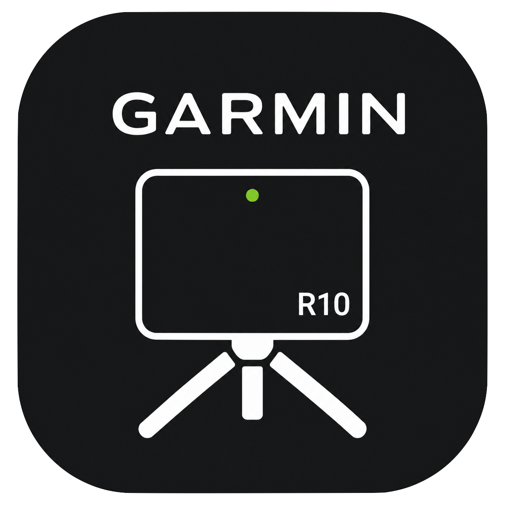

<p align="center">
  
</p>

# R10Progress

Track and visualize golf shot data from the **Garmin Approach R10** launch monitor. Import CSV exports from the Garmin Golf app, explore dispersion and trends, optionally run **AI session analysis**, and keep everything **on your machine**—no Firebase and no vendor cloud for your swing data.

This repo is a self-hosted fork of [thraizz/r10progress](https://github.com/thraizz/r10progress): **React + TypeScript** frontend, **Node/Express + SQLite** backend, shipped as **one Docker image**.

---

## Features

- **CSV import** — R10 exports in **English, German, Spanish, or Dutch** column layouts.
- **Charts & stats** — Dispersion and performance views (Vega / ECharts).
- **Shot table** — ag-Grid with sorting and filtering.
- **AI coaching report** — Optional OpenAI-powered session write-up, practice drills, and a strokes-gained-style priority plan (API key required).
- **Sessions & reports** — Organize uploads and revisit saved AI reports.
- **Goals** — Work in progress for metric targets.
- **Single-user, local-first** — SQLite database; no accounts or remote sync.

---

## Quick start (Docker)

Best path if you only want to run the app.

```bash
git clone https://github.com/whiskeykilo/r10progress.git
cd r10progress
docker build -t r10progress .
docker run -p 8080:8080 -v r10progress-data:/data r10progress
```

Open **[http://localhost:8080](http://localhost:8080)**. The UI and `/api` are served together. SQLite lives on the `**/data`** volume (`sqlite.db`).

To enable AI analysis, pass an API key:

```bash
docker run -p 8080:8080 -v r10progress-data:/data \
  -e OPENAI_API_KEY=sk-... \
  r10progress
```

Everything else (import, charts, tables, sessions) works **without** a key. With `OPENAI_API_KEY` set, the backend can call OpenAI when you run analysis (normal API usage and billing apply).

**What the key unlocks**

- **AI session report** — Structured coaching-style breakdown from your aggregated R10 stats: impact and ball-flight dimensions (scores + consistency), overall performance metrics, trend hints, dispersion summary, and plain-language **common issues**.
- **Practice plan** — A **high-priority focus** line plus **drill cards**: named drills, steps you can do alone, difficulty level, and **success metrics** you can verify on the next range session.
- **Strokes Gained–style priority plan** — The app also attaches a **deterministic, server-built “SG-first” plan**: ranked improvement areas (for example approach vs off-the-tee) with rationale, evidence from your numbers, and a targeted drill for each priority. This complements the model-written report and is stored with the same saved report.
- **Session names** — When you save a session, the server can suggest a short, human-style session title from the clubs you hit (falls back to a simple name if the key is missing).

Repeated runs with the same inputs can be **served from cache** so you are not charged again for identical analysis.

### Environment variables

| Variable         | Default      | Purpose                                                                |
| ---------------- | ------------ | ---------------------------------------------------------------------- |
| `OPENAI_API_KEY` | —            | Enables AI reports, practice drills, SG plan, and smart session titles |
| `PORT`           | `8080`       | HTTP port inside the container                                         |
| `DATA_DIR`       | `{cwd}/data` | Directory for `sqlite.db`                                              |
| `STATIC_DIR`     | `{cwd}/dist` | Built SPA (set automatically in the image)                             |

---

## Using the app

1. **Practice** with the R10 and sync sessions to the **Garmin Golf** mobile app.
2. **Export** the session as **CSV** from the app (exact menus vary by platform; use the session export / share flow your app version provides).
3. **Open R10Progress** in the browser (Docker: port **8080**; local dev: **5173** below).
4. **Upload** the CSV from the Upload flow. The app parses units and column names for supported locales.
5. **Explore**:

- **Dashboard** — Overview of your data.
- **Sessions** — List and manage imported sessions.
- **Visualization** — Charts for dispersion and trends.
- **Reports** / **AI analysis** — Stored reports and new analysis (needs `OPENAI_API_KEY`).
- **Settings** — Units, filtering behavior, and related options.
- **Goals** — Experimental goal tracking.

There is **no login** in self-hosted mode; anyone who can reach the URL can use the instance—run it on a trusted network or behind your own auth reverse proxy if needed.

---

## Filtering and view modes

Understanding these helps you interpret distances and dispersion fairly.

- **Shot Quality filter (default)** — Combines a smash-factor floor for true irons (3i–9i) with carry-distance standard-deviation filtering. Default SD mode is asymmetric (**2σ** low / **3σ** high).
- **IQR fallback (optional)** — Statistical outlier removal on total distance. Useful when Shot Quality does not have enough shots.
- **Best shots view (optional)** — “Best shots only” is a **display** mode to inspect potential; it is not meant as the cleaning rule for course-management distances.
- **Method choice** — Shot Quality and IQR are **mutually exclusive** in settings.

---

## Development

**Requirements:** Node **22**, **pnpm** (see root `packageManager` for the expected pnpm version).

```bash
git clone https://github.com/whiskeykilo/r10progress.git
cd r10progress
pnpm install
pnpm --dir server install
pnpm dev
```

- **Frontend (Vite):** [http://localhost:5173](http://localhost:5173)
- **API:** [http://localhost:8080](http://localhost:8080) — Vite proxies `/api` to the server, so use the **5173** URL in the browser.

SQLite is created automatically under `**./data`** on first API use.

For AI features during development, export a key in the shell that runs the server (there is no bundled `.env` loader):

```bash
export OPENAI_API_KEY=sk-...
pnpm dev
```

Useful scripts (repo root): `pnpm build`, `pnpm lint`, `pnpm test`, `pnpm preview` (static production build preview only—no API).

### Run a local production build (no Docker)

After `pnpm build`:

```bash
# From repo root; serves UI + API on PORT (default 8080)
OPENAI_API_KEY=sk-... node server/dist/index.js
```

Ensure dependencies are installed and the server is compiled (`pnpm --dir server build`). Defaults assume current working directory is the **repo root** so `DATA_DIR` resolves to `./data` and the bundled SPA is found under `./dist`.

---

## Contributing

Fork and open a pull request. Upstream ideas and attribution: [thraizz/r10progress](https://github.com/thraizz/r10progress).

### Local checks before you push

```bash
pnpm verify:push
```

Runs install, lint, typechecks, tests, and a Docker build—similar to CI.

Git hook (optional):

```bash
pnpm hooks:install
```

Skips: `SKIP_INSTALL=1` or `SKIP_DOCKER=1` with `pnpm verify:push`.

---

## Support

Open an issue on this repository. To support the original author: [Buy Me a Coffee — Aron Schüler](https://buymeacoffee.com/aronschueler).

---

## License

[GNU LGPLv3](https://opensource.org/license/lgpl-3-0/).

---

## Disclaimer

R10Progress is not affiliated with Garmin Ltd. Garmin is a registered trademark of Garmin Ltd.
